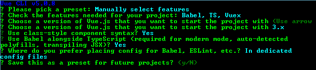

# Welcome in the NEW CHAPTER Full Stack Installation !

## Links

- [Back-End](./../Back-End/)
- [Front-End](./../Front-End/)
- [Root](https://github.com/LunashaGit/Javascript-TO-Typescript-skills-Power-Rangers-Group/)

### Websites

#### Librairies & Framework Installations in TypeScript (Front-End & Back-End)

- [NEXTJS Full Stack Framework](#NEXT)
- [REACT Front-End Library](#REACT)
- [REACT-VITE Front-End Library](#REACT-VITE)
- [VUE Front-End Framework](#VUE)
- [Angular Front-End Framework](#ANGULAR)

- [EXPRESSJS Back-End Framework](#EXPRESS)

- [EVERY NPM PACKAGE](#EVERY-NPM-PACKAGE)

#### Visual Studio Code Extensions

- [TypeScript Importer](https://marketplace.visualstudio.com/items?itemName=pmneo.tsimporter)
- [TypeScript Hero](https://marketplace.visualstudio.com/items?itemName=rbbit.typescript-hero)
- [TypeScript Explorer](https://marketplace.visualstudio.com/items?itemName=mxsdev.typescript-explorer)

## Disclaimer

You're not obliged to use VSCode & the extensions! For example, me i don't use some extensions, but i use VSCode!

## NEXT


### Installation FROM ZERO

```bash
npx create-next-app@latest --ts
# or
yarn create next-app --typescript
# or
pnpm create next-app --ts
```

### Existing Project

```bash
npm install --save-dev typescript @types/node
# &&
touch tsconfig.json
```

### Configuration

```js
// @ts-check

/**
 * @type {import('next').NextConfig}
 **/
const nextConfig = {
  /* config options here */
};

module.exports = nextConfig;
```

### LAUNCH THE SERVER

```bash
npm run dev
# or
yarn dev
# or
pnpm dev
```

## REACT


### Installation FROM ZERO

```bash
npx create-react-app my-app --template typescript
# or
yarn create react-app my-app --template typescript
```

### Existing Project

```bash
npm install --save typescript @types/node @types/react @types/react-dom @types/jest
# &&
yarn add typescript @types/node @types/react @types/react-dom @types/jest
```

### Configuration

Rename JS, JSX files to TS, TSX

### LAUNCH THE SERVER

```bash
npm start
# or
yarn start
```

## REACT-VITE

### Installation FROM ZERO


```bash
npm init vite@latest NAME -- --template react-ts
# or
yarn create vite NAME --template react-ts
```

### Existing Project

```bash
npm install --save-dev typescript @types/node
# &&
touch tsconfig.json
```

### LAUNCH THE SERVER

```bash
npm run dev
# or
yarn dev
```

## VUE


### Installation

```bash
npx @vue/cli create typescript-app
```

### Configuration Installation



### LAUNCH THE SERVER

```bash
npm run serve
# or
yarn serve
```

## ANGULAR


### Installation

```bash
npm install -g @angular/cli
# &&
ng new NAME
```

### LAUNCH THE SERVER

```bash
ng serve
```

## EXPRESS


### Installation

```bash
npm init -y
# &&
npm install express
# &&
npm install -D typescript @types/node @types/express
# &&
npx tsc --init
# &&
npm i -g tsx
```

### Configuration

```bash
touch tsconfig.json
```

```json
{
  "compilerOptions": {
    "module": "commonjs",
    "target": "ES5",
    "lib": ["dom", "dom.iterable"],
    "allowJs": true,
    "skipLibCheck": true,
    "strict": true,
    "forceConsistentCasingInFileNames": true,
    "noEmit": true,
    "esModuleInterop": true,
    "moduleResolution": "node",
    "resolveJsonModule": true,
    "isolatedModules": true,
    "jsx": "preserve",
    "incremental": true,
    "baseUrl": ".",
    "paths": {
      "@/*": ["./src/*"]
    }
  },
  "include": ["**/*.ts", "**/*.tsx"],
  "exclude": ["node_modules"]
}
```

### LAUNCH THE SERVER

```json
{
  "scripts": {
    "backend": "tsx watch ./index.tsx"
  }
}
```

## EVERY NPM PACKAGE


### Installation

```bash
# @types/NAME is the TypeScript definition file for the package NAME
npm install --save-dev typescript @types/node
```
